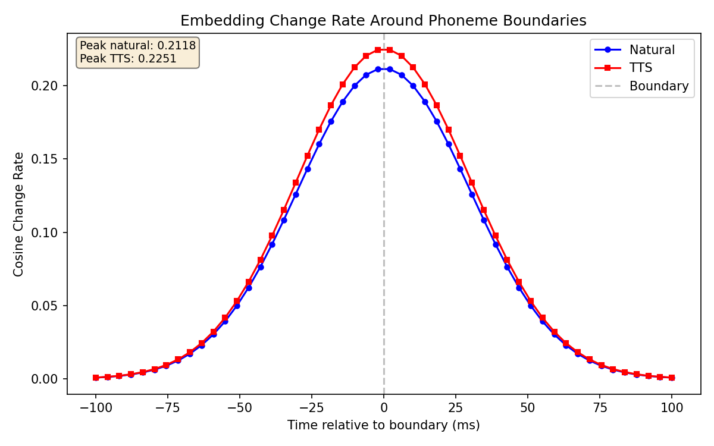
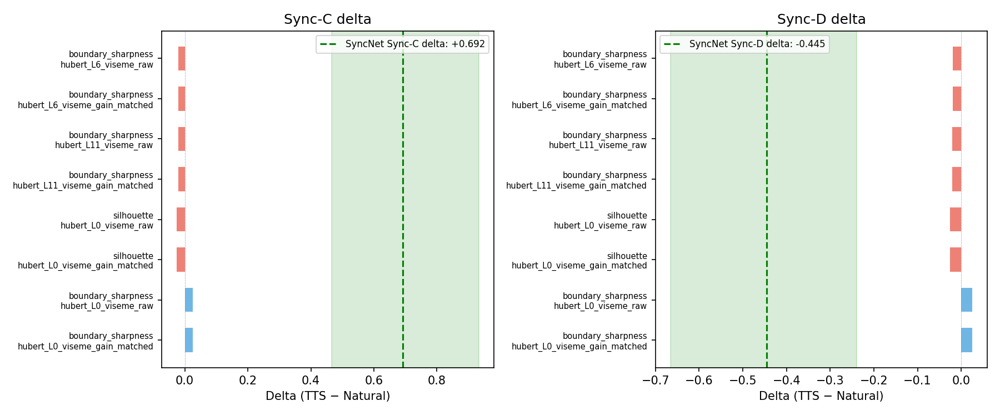
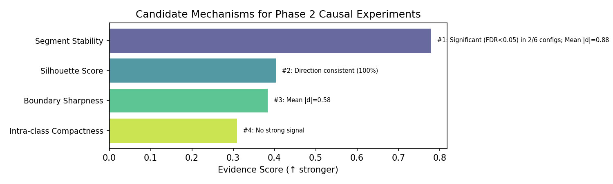

# Wav2Sem-Style Analysis — Phase 1 Report

*Generated by `scripts/18_render_wav2sem_report.py`*

## 1. Experiment Summary

### Goal

Characterise how text-to-speech (TTS) synthesis affects speech encoder representations compared to natural speech, using Wav2Sem-style analysis (Ditto et al., 2024) adapted for Mandarin Chinese. The analysis quantifies changes in acoustic-phonetic feature separability, boundary sharpness, and their association with SyncNet lip-sync quality scores from Talking Face Generation (TFG) models.

### Data

- **Samples**: n=12 paired natural/TTS utterances from AISHELL-1 (sample 9 excluded after SyncNet failure)
- **TTS engine**: Faster-Qwen3 (primary)
- **TFG model**: Ditto (antgroup/ditto-talkinghead)
- **Evaluation metric**: SyncNet (Sync-C confidence, Sync-D min distance)

### Conditions

| Factor | Levels |
|--------|--------|
| Source | natural, tts |
| Variant | raw, gain_matched (EBU R128 −23 LUFS) |
| SSL Model | HuBERT, XLS-R |
| Layer | 0, 6, 11, 12 |
| Classification Level | initial (consonant), final (vowel), viseme (7 categories) |

## 2. Embedding Separability

### Per-Metric Deltas (Natural → TTS)

| Metric | Model | Layer | Level | Variant | Natural Mean | TTS Mean | Delta | Cohen's d | p (perm) | FDR q | Significant |
|--------|-------|-------|-------|---------|-------------|----------|-------|-----------|----------|--------|-------------|
| intra_class_dist | hubert | 0 | viseme | raw | 0.7419 | 0.7602 | -0.0184 | -0.8272 | 0.0215 | 0.0860 | no |
| silhouette | hubert | 0 | viseme | raw | -0.0886 | -0.0631 | -0.0255 | -0.5753 | 0.0695 | 0.1346 | no |
| boundary_sharpness | hubert | 0 | viseme | raw | 0.3266 | 0.3011 | 0.0255 | 0.7284 | 0.0350 | 0.1050 | no |
| segment_stability | hubert | 0 | viseme | raw | 0.3208 | 0.3110 | 0.0099 | 0.6569 | 0.0525 | 0.1260 | no |
| intra_class_dist | hubert | 0 | viseme | gain_matched | 0.7419 | 0.7602 | -0.0184 | -0.8272 | 0.0215 | 0.0860 | no |
| silhouette | hubert | 0 | viseme | gain_matched | -0.0886 | -0.0631 | -0.0255 | -0.5754 | 0.0695 | 0.1346 | no |
| boundary_sharpness | hubert | 0 | viseme | gain_matched | 0.3266 | 0.3011 | 0.0255 | 0.7285 | 0.0350 | 0.1050 | no |
| segment_stability | hubert | 0 | viseme | gain_matched | 0.3208 | 0.3110 | 0.0099 | 0.6569 | 0.0525 | 0.1260 | no |
| intra_class_dist | hubert | 6 | viseme | raw | 0.7816 | 0.7833 | -0.0016 | -0.1619 | 0.5590 | 0.5590 | no |
| silhouette | hubert | 6 | viseme | raw | -0.0488 | -0.0354 | -0.0134 | -0.3808 | 0.2330 | 0.2796 | no |
| boundary_sharpness | hubert | 6 | viseme | raw | 0.1657 | 0.1856 | -0.0200 | -0.4472 | 0.1440 | 0.2160 | no |
| segment_stability | hubert | 6 | viseme | raw | 0.1722 | 0.1839 | -0.0117 | -0.9274 | 0.0085 | 0.0510 | no |
| intra_class_dist | hubert | 6 | viseme | gain_matched | 0.7816 | 0.7833 | -0.0016 | -0.1619 | 0.5590 | 0.5590 | no |
| silhouette | hubert | 6 | viseme | gain_matched | -0.0488 | -0.0354 | -0.0134 | -0.3808 | 0.2330 | 0.2796 | no |
| boundary_sharpness | hubert | 6 | viseme | gain_matched | 0.1657 | 0.1856 | -0.0200 | -0.4472 | 0.1440 | 0.2160 | no |
| segment_stability | hubert | 6 | viseme | gain_matched | 0.1722 | 0.1839 | -0.0117 | -0.9273 | 0.0085 | 0.0510 | no |
| intra_class_dist | hubert | 11 | viseme | raw | 0.7187 | 0.7123 | 0.0064 | 0.4029 | 0.1840 | 0.2453 | no |
| silhouette | hubert | 11 | viseme | raw | -0.0614 | -0.0471 | -0.0143 | -0.2544 | 0.5180 | 0.5590 | no |
| boundary_sharpness | hubert | 11 | viseme | raw | 0.1432 | 0.1642 | -0.0210 | -0.5511 | 0.0785 | 0.1346 | no |
| segment_stability | hubert | 11 | viseme | raw | 0.1506 | 0.1634 | -0.0128 | -1.0453 | 0.0020 | 0.0240 | **yes** |
| intra_class_dist | hubert | 11 | viseme | gain_matched | 0.7187 | 0.7123 | 0.0064 | 0.4029 | 0.1840 | 0.2453 | no |
| silhouette | hubert | 11 | viseme | gain_matched | -0.0614 | -0.0471 | -0.0143 | -0.2544 | 0.5180 | 0.5590 | no |
| boundary_sharpness | hubert | 11 | viseme | gain_matched | 0.1432 | 0.1642 | -0.0210 | -0.5512 | 0.0785 | 0.1346 | no |
| segment_stability | hubert | 11 | viseme | gain_matched | 0.1506 | 0.1634 | -0.0128 | -1.0453 | 0.0020 | 0.0240 | **yes** |

*Delta = TTS − Natural for each paired sample. p (perm) = two-tailed paired permutation test. FDR q = Benjamini-Hochberg corrected p-value. Significant = FDR q < 0.05.*

**Summary**: 2/24 comparisons significant at FDR < 0.05.

## 3. Near-Confusable Analysis

Top confusable viseme pairs (by centroid cosine distance) and how TTS changes the separation:

**Condition**: natural | **Layer**: 0 | **Model**: hubert

| Pair | Cosine Distance |
|------|----------------|
| bilabial vs nonlabial_consonant | 0.0720 |
| labiodental vs nonlabial_consonant | 0.0789 |
| bilabial vs labiodental | 0.1269 |

**Condition**: natural | **Layer**: 0 | **Model**: hubert

| Pair | Cosine Distance |
|------|----------------|
| bilabial vs nonlabial_consonant | 0.0720 |
| labiodental vs nonlabial_consonant | 0.0789 |
| bilabial vs labiodental | 0.1269 |

*Lower distance = more confusable. Viseme categories are defined in `data/wav2sem_analysis/mandarin_viseme_map.yaml`.*

## 4. Boundary Analysis

Embedding cosine change rate around phoneme boundaries quantifies how sharply SSL representations delineate phonetic transitions.

| Model | Layer | Level | Variant | Delta | Cohen's d | Significant |
|-------|-------|-------|---------|-------|-----------|-------------|
| hubert | 0 | viseme | raw | 0.02551232161259048 | 0.7284193832730774 | no |
| hubert | 0 | viseme | gain_matched | 0.025513438415408374 | 0.728471237866273 | no |
| hubert | 6 | viseme | raw | -0.01995072301500852 | -0.4471589764056576 | no |
| hubert | 6 | viseme | gain_matched | -0.019952751141474167 | -0.4471929363740229 | no |
| hubert | 11 | viseme | raw | -0.02103655850001343 | -0.5511391825159818 | no |
| hubert | 11 | viseme | gain_matched | -0.02103840650542535 | -0.5511931711066125 | no |

## 5. TFG Association

The following TFG models were available for cross-feature analysis: ditto_faster_qwen3, tfg_wav2lip, tfg_musetalk, tfg_latentsync, tfg_joyvasa.

### SyncNet Aggregate Deltas (TTS − Natural)

| Metric | Mean Delta | 95% Bootstrap CI |
|--------|-----------|------------------|
| Sync-C delta | +0.692 | [+0.466, +0.932] |
| Sync-D delta | -0.445 | [-0.666, -0.240] |

*Positive Sync-C delta = TTS improves confidence. Negative Sync-D delta = TTS reduces distance (better lip-sync).*

### Spearman Correlations (Feature Delta vs Sync Delta)

| Feature Metric | TFG Model | Sync-C ρ | Sync-C p | Sync-D ρ | Sync-D p |
|---------------|-----------|----------|----------|----------|----------|
| intra_class_dist | ditto_faster_qwen3 | nan | nan | nan | nan |
| silhouette | ditto_faster_qwen3 | nan | nan | nan | nan |
| boundary_sharpness | ditto_faster_qwen3 | nan | nan | nan | nan |
| segment_stability | ditto_faster_qwen3 | nan | nan | nan | nan |
| intra_class_dist | ditto_faster_qwen3 | nan | nan | nan | nan |
| silhouette | ditto_faster_qwen3 | nan | nan | nan | nan |
| boundary_sharpness | ditto_faster_qwen3 | nan | nan | nan | nan |
| segment_stability | ditto_faster_qwen3 | nan | nan | nan | nan |
| intra_class_dist | ditto_faster_qwen3 | nan | nan | nan | nan |
| silhouette | ditto_faster_qwen3 | nan | nan | nan | nan |
| boundary_sharpness | ditto_faster_qwen3 | nan | nan | nan | nan |
| segment_stability | ditto_faster_qwen3 | nan | nan | nan | nan |
| intra_class_dist | ditto_faster_qwen3 | nan | nan | nan | nan |
| silhouette | ditto_faster_qwen3 | nan | nan | nan | nan |
| boundary_sharpness | ditto_faster_qwen3 | nan | nan | nan | nan |
| segment_stability | ditto_faster_qwen3 | nan | nan | nan | nan |
| intra_class_dist | ditto_faster_qwen3 | nan | nan | nan | nan |
| silhouette | ditto_faster_qwen3 | nan | nan | nan | nan |
| boundary_sharpness | ditto_faster_qwen3 | nan | nan | nan | nan |
| segment_stability | ditto_faster_qwen3 | nan | nan | nan | nan |
| intra_class_dist | ditto_faster_qwen3 | nan | nan | nan | nan |
| silhouette | ditto_faster_qwen3 | nan | nan | nan | nan |
| boundary_sharpness | ditto_faster_qwen3 | nan | nan | nan | nan |
| segment_stability | ditto_faster_qwen3 | nan | nan | nan | nan |
| intra_class_dist | tfg_joyvasa | nan | nan | nan | nan |
| silhouette | tfg_joyvasa | nan | nan | nan | nan |
| boundary_sharpness | tfg_joyvasa | nan | nan | nan | nan |
| segment_stability | tfg_joyvasa | nan | nan | nan | nan |
| intra_class_dist | tfg_joyvasa | nan | nan | nan | nan |
| silhouette | tfg_joyvasa | nan | nan | nan | nan |

## 6. Candidate Mechanisms for Phase 2

Mechanisms ranked by evidence strength (effect size × consistency × significance):

| Rank | Mechanism | Score | Evidence |
|------|-----------|-------|----------|
| 1 | Segment Stability | 0.779 | Significant (FDR<0.05) in 2/6 configs; Mean |d|=0.88 |
| 2 | Silhouette Score | 0.404 | Direction consistent (100%) |
| 3 | Boundary Sharpness | 0.384 | Mean |d|=0.58 |
| 4 | Intra-class Compactness | 0.309 | No strong signal |

*Score combines effect size (Cohen's d), cross-model consistency, and statistical significance.*

## 7. Limitations

1. **Sample size (n=12)**: With only 12 paired samples, statistical power is limited. Bootstrap confidence intervals and effect sizes (Cohen's d) are reported alongside p-values. Results should be interpreted as exploratory.

2. **SyncNet-only evaluation**: SyncNet is the sole evaluation metric for lip-sync quality. Results reflect SyncNet sensitivity to acoustic features, not necessarily human-perceived video quality. Future work should incorporate perceptual studies.

3. **Dimensionality reduction**: Figures using t-SNE (umap-learn not installed; using sklearn.manifold.TSNE as fallback) are for **visual exploration only** — statistical tests use raw high-dimensional embeddings.

4. **TTS generalisation**: Results are specific to Faster-Qwen3 on AISHELL-1 Mandarin Chinese. Cross-TTS-engine and cross-language validation is needed before generalising.

5. **Single TFG model**: Only Ditto was evaluated. Different TFG architectures (Wav2Lip, MuseTalk, LatentSync, JoyVASA) may exhibit different sensitivities to acoustic features.

6. **Alignment quality**: Viseme classification depends on forced alignment accuracy. MFA alignment errors propagate to per-token embedding pooling.

## Figures Generated

- `figures/boundary_sharpness_curve.png`
- `figures/candidate_ranking.png`
- `figures/feature_vs_sync_scatter.png`
- `figures/metrics_forest_plot.png`
- `figures/syncnet_summary.png`

### Figure Notes

- [umap_natural_vs_tts] UMAP projection failed: index 3 is out of bounds for axis 0 with size 3
- [confusables_detail] No confusable pairs data available — skipping confusables detail figure.
- [probe_confusion] No probe confusion matrix data available — skipping probe confusion figure.

---

*Figures using t-SNE (umap-learn not installed; using sklearn.manifold.TSNE as fallback) are for visual exploration only — statistical tests use raw high-dimensional embeddings.*

*SyncNet is the sole evaluation metric — results reflect SyncNet sensitivity, not necessarily human-perceived video quality.*

*n=12 paired samples limits statistical power — report includes bootstrap CIs and effect sizes, not just p-values.*

*Generated by `scripts/18_render_wav2sem_report.py`*
